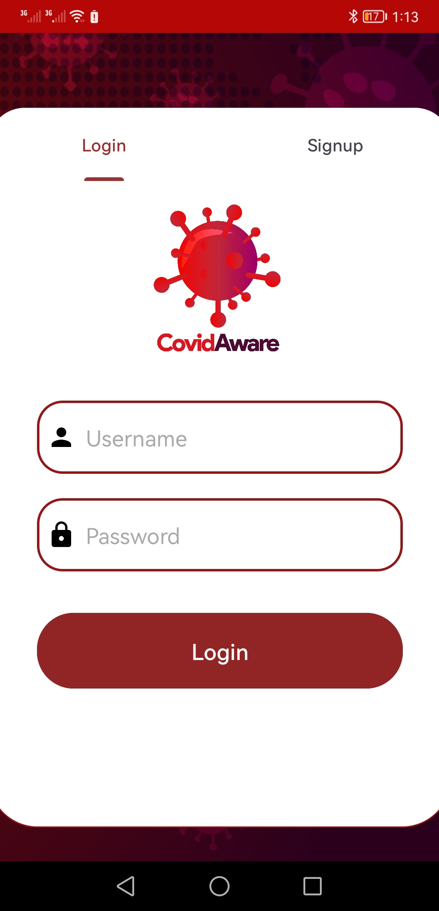
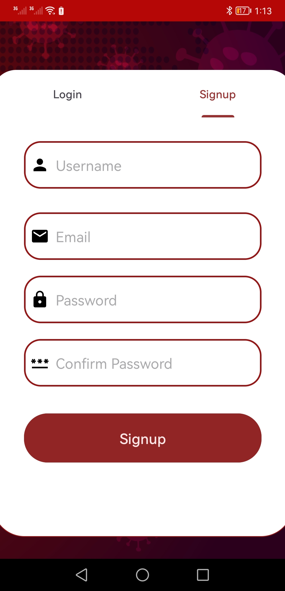
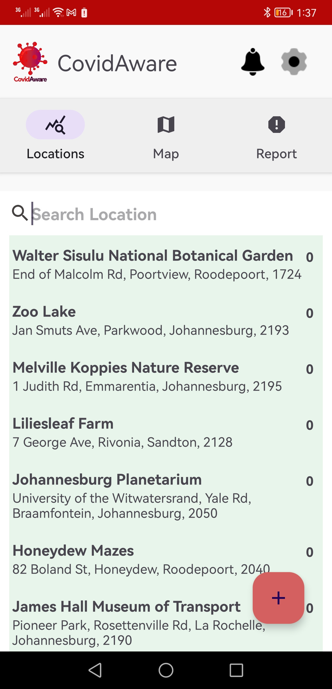
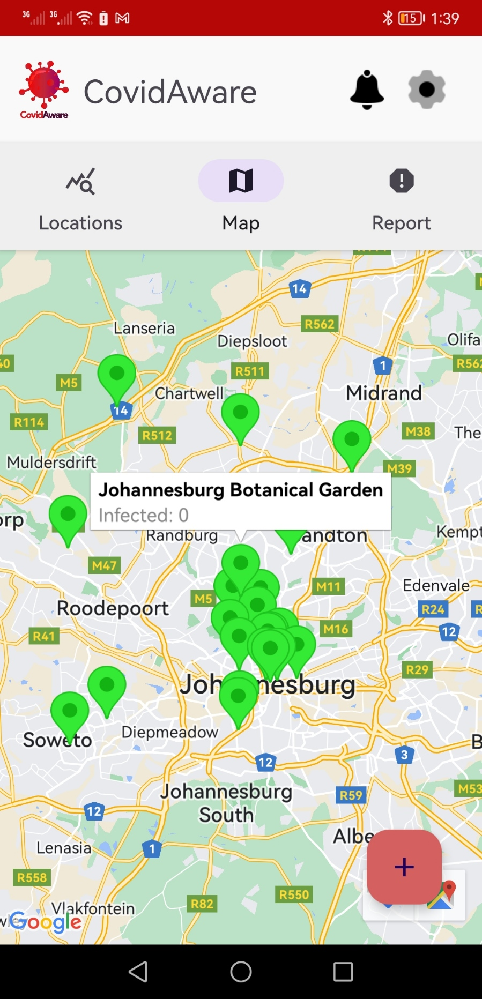
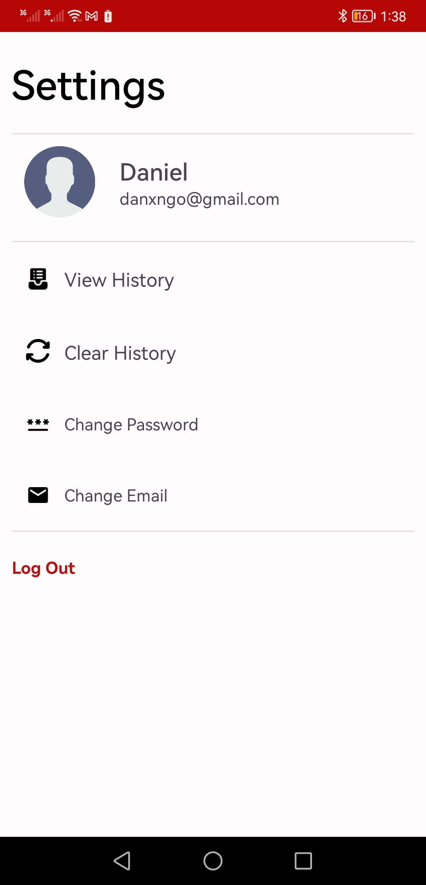
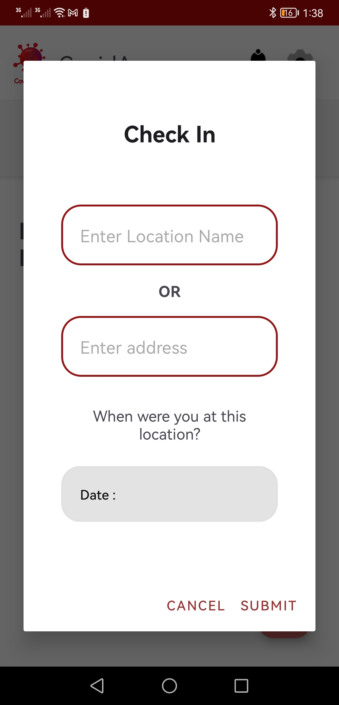

# CovidAware

CovidAware is an Android application designed to help users stay informed about COVID-19 infection rates in various locations. The app tracks centers and provides real-time data on the number of infected people in those places. It also features a map with pins that change color to reflect the number of infected individuals. Users can check-in to locations, report their status, and receive notifications if they visited a place with a reported infection.

## Features

- **Track Infection Rates:** View the number of infected people in various locations.
- **Interactive Map:** See a map with pins that change color based on the number of infections.
- **Check-in and Reporting:** Users can check-in to locations and report their health status.
- **Infection Alerts:** Receive notifications if an infected person was present at a place you've visited.

## Screenshots

1. **Sign-In** and **Sign-Up**

    

2. **Home Screen** and **Map View**

    

3. **Settings Screen** and **Check-in Screen**

    

## Installation

1. Clone the repository:
   ```bash
   git clone https://github.com/TheNumbered/covid-aware.git


## Acknowledgments
This project was developed as part of the Mobile Computing course at Wits University by the following team:

Daniel Ngobe,
Karabo Joshua,
Kharendwe Negota,
Olwethu
